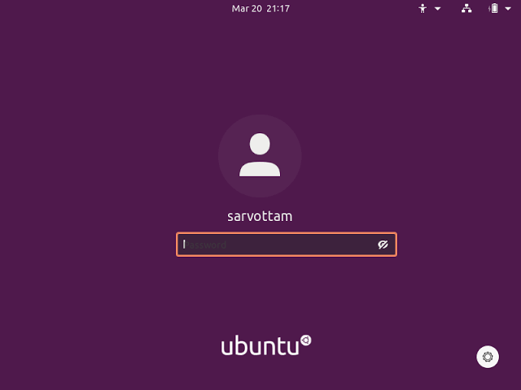
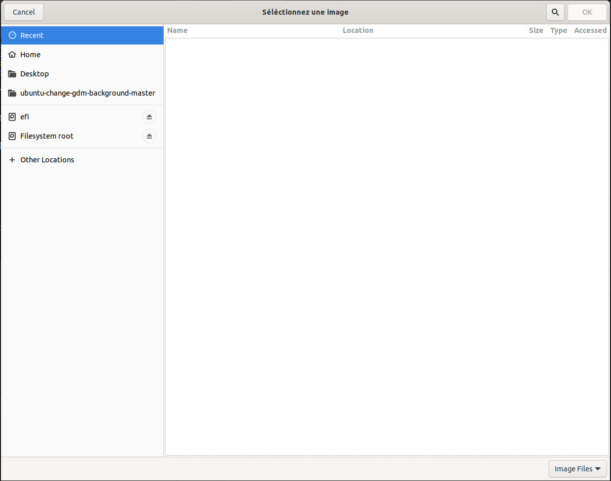

# Changer de fond au login Ubuntu
Il s'agit d'un script qui change l'arrière-plan de l'écran de connexion 
d'Ubuntu (qui est la plupart du temps en violet).



## Disclaimer
Ce script est repris de <a href = "mailto: gaby.theuws@gmail.com">Gabriel Theuws</a>  avec comme ajout une description rapide de comment l'utiliser.

## Installation et Usage

- Téléchargez le ZIP et unzippez-le ou clonez le repo 

- Donnez les droits au script pour pouvoir l'exécuter:
```chmod +x gdm-change-ubuntu20.04+```.

- Exécutez le script avec
```sudo ./gdm-change-ubuntu20.04+```.

Optionnelement vous pouvez cacher le filigrane "Ubuntu" (enlève le logo Ubuntu quand vous bootez sur Ubuntu et au login) sur l'écran de connexion avec l'option:
```--cache-filigrane```

il suffit donc le rajouter à la commande:
```sudo ./gdm-change-ubuntu20.04+ --cache-filigrane```

Vous tomberez alors sur cette page:



Si vous voulez aller au niveau du stockage de votre pc pour retrouver votre photo allez sur:
- Other Locations
- Computer
- home
- (le nom de votre pc)
- le dossier ou est stocké votre image)

Cliquez sur  puis dans le terminal entrez ```o``` ce qui redémarrera votre pc et vous aurez votre nouveau fond d'écran.


## Retrouver l'ancien thème 

Vous pouvez restaurer le thème original via l'option `--restore` sur tout les scripts.

<br>

---

<div align="center">

<a href="https://github.com/Studio-17" target="_blank"></a>

</div>